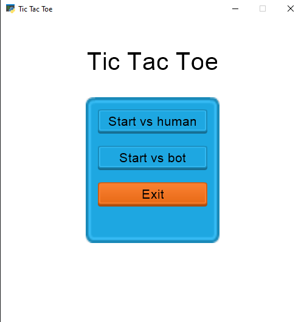
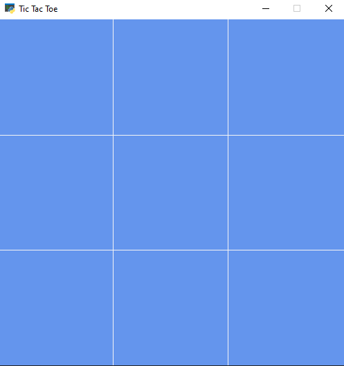

# Tic Tac Toe (Python)

This is a fun and challenging Tic Tac Toe game written in Python. You can choose to play against the computer (AI) or another human player.

## Requirements

* Python 3 <= v3.10.9 (Download from [https://www.python.org/downloads/](https://www.python.org/downloads/))

**Installation**

  ```bash
    pip install -r requirements.txt
  ```

## Running the Game

  1. Open a terminal or command prompt.
  2. Navigate to the directory containing the Python source.
  3. Run the script using the following command:

  ```bash
    python ./client/main.py
  ```
  *Note: Run server when play with human mode*
  ```bash
    python ./server/server.py
  ```
  4. The game will launch with a graphical board for an enhanced visual experience.
  
  **Choose game mode**
* Start with Human (Play online with other people on the same LAN internet)
* Start with Bot (Play offline with mcts bot)

  **Home screen**
  <div style="text-align:center">
    
  </div>

  **Board game**
  <div style="text-align:center">
    
  </div>

## Gameplay

**Taking Turns**

The game will alternate turns between you and your opponent (AI or another player).

  * Click on the desired square on the game board to place your mark.

**Winning and Ending the Game**

The game continues until one of the following conditions is met:

* **Win:** A player gets three marks in a row (horizontally, vertically, or diagonally).
* **Tie:** The board is full, and no player has achieved three in a row.
* **Exit:** You choose to exit the game.

The game will announce the winner or a tie and provide options to play again or exit.

## Additional Notes

* The specific instructions for making moves, displaying the board, and handling wins/ties might vary slightly depending on the game's implementation. Refer to any comments or messages within the source code for more details.
* This is a basic example. Some implementations might offer additional features like:
  * Difficulty levels for the AI opponent.
  * Visual enhancements using the graphical interface.

Have fun playing Tic Tac Toe!
